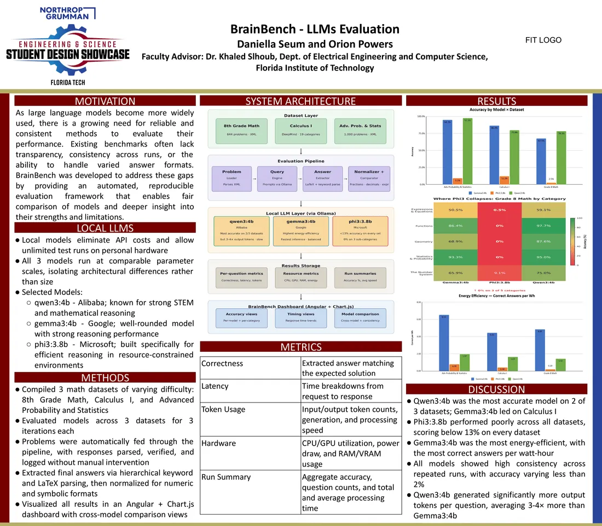

# BrainBench

**An interactive dashboard for comparing local language models on mathematical reasoning.**

[Live dashboard](https://p-orion.github.io/) · [Methodology](https://p-orion.github.io/methodology.html) · [Dataset breakdown](https://p-orion.github.io/datasets.html) · [Orion's portfolio](https://orionpowers.com)

BrainBench is a Florida Tech senior design project developed by **Orion Powers and Daniella Seum**, with **Dr. Khaled Slhoub** as faculty advisor and client. The broader research investigates local LLM reasoning, behavior, and performance. Findings were presented at the Northrop Grumman Engineering & Science Student Design Showcase; a co-authored paper is **under peer review**.

## Explore the results

The published dashboard compares **Gemma 3 4B**, **Phi-3 3.8B**, and **Qwen3 4B** across **2,544 questions per model**:

| Dataset | Questions |
| --- | ---: |
| Advanced Probability & Statistics | 1,000 |
| Calculus I | 900 |
| Grade 8 Math | 644 |

Charts show accuracy by dataset and topic, response-time comparisons, and model capability profiles. Results describe this benchmark snapshot; they are not a general ranking of model quality.

## Research presentation



The showcase poster describes the broader research and its presentation-stage results. The dashboard's specific snapshot is recorded in [`js/data.js`](js/data.js); versions should not be treated as interchangeable experimental runs.

## What this repository contains

This repository publishes the **static dashboard, aggregate benchmark data, and methodology explanation**. It is built with HTML, JavaScript, Tailwind CSS, and Chart.js.

The Python evaluation runner, original XML question sets, per-question model responses, and original results workbook are **not included in this repository**. Hosting the dashboard reproduces the visualization, not the model experiments. See [data provenance and scope](docs/DATA-PROVENANCE.md).

## Run locally

```bash
git clone https://github.com/P-Orion/P-Orion.github.io.git
cd P-Orion.github.io
python -m http.server 8080
```

Open **http://localhost:8080**. Windows users with the Python launcher can use `py -m http.server 8080`. No build step, API key, or Ollama installation is needed to view the dashboard. Internet access is needed for CDN styles and chart libraries.

## Repository map

| File | Purpose |
| --- | --- |
| [`index.html`](index.html) | Overall results and model comparison |
| [`models.html`](models.html) | Individual model profiles |
| [`datasets.html`](datasets.html) | Dataset and topic breakdowns |
| [`methodology.html`](methodology.html) | Evaluation and answer-verification overview |
| [`about.html`](about.html) | Project background and team |
| [`js/data.js`](js/data.js) | Published aggregate benchmark snapshot |
| [`js/charts.js`](js/charts.js) | Chart rendering |

## Engineering focus

- Compare correctness and latency together instead of treating either as a complete measure.
- Present dataset and topic breakdowns so aggregate scores can be investigated.
- Separate answer extraction, verification, and model reasoning when interpreting results.
- Keep publication status, team attribution, and the scope of released artifacts explicit.

**Orion Powers** · [Portfolio](https://orionpowers.com) · [LinkedIn](https://www.linkedin.com/in/orion-powers/)
